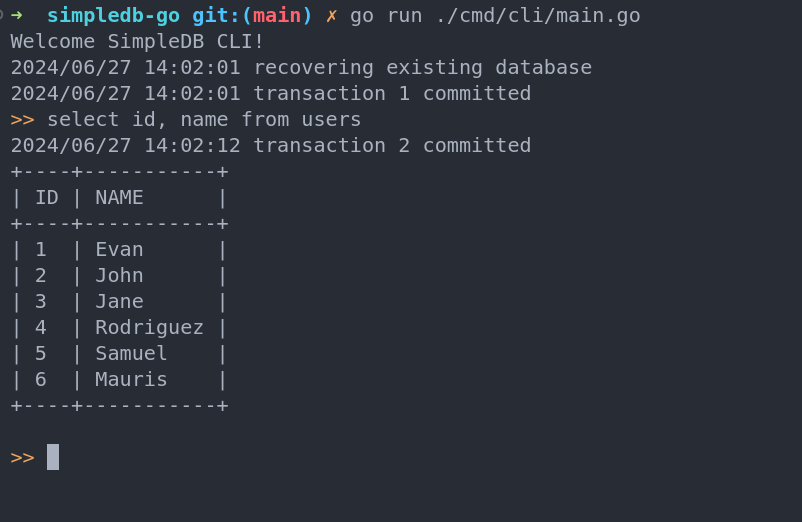

# simpledb-go

This project implements SimpleDB in golang. SimpleDB is an educational
database management system presented in Edward Sciore's book titled 
[Database Design and Implementation 2nEd](https://www.amazon.com/Database-Design-Implementation-Edward-Sciore/dp/0471757160)

# Features not implemented yet
- Support for indexing (B+Tree, Hash)
- Support for Aggregate queries

## References:

- https://howqueryengineswork.com/00-introduction.html

